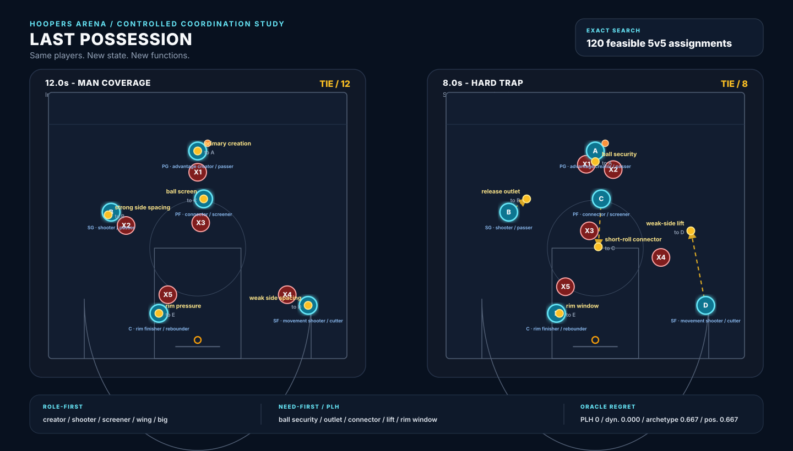
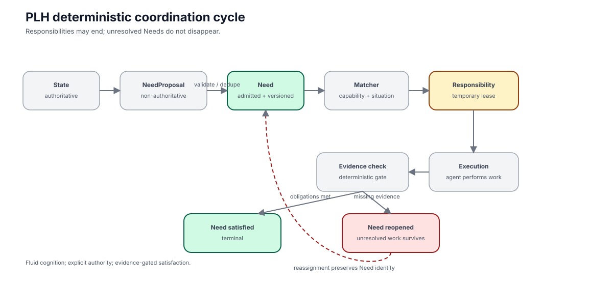
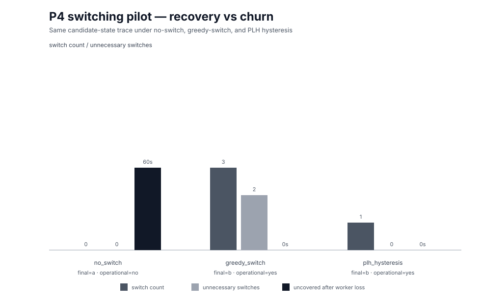
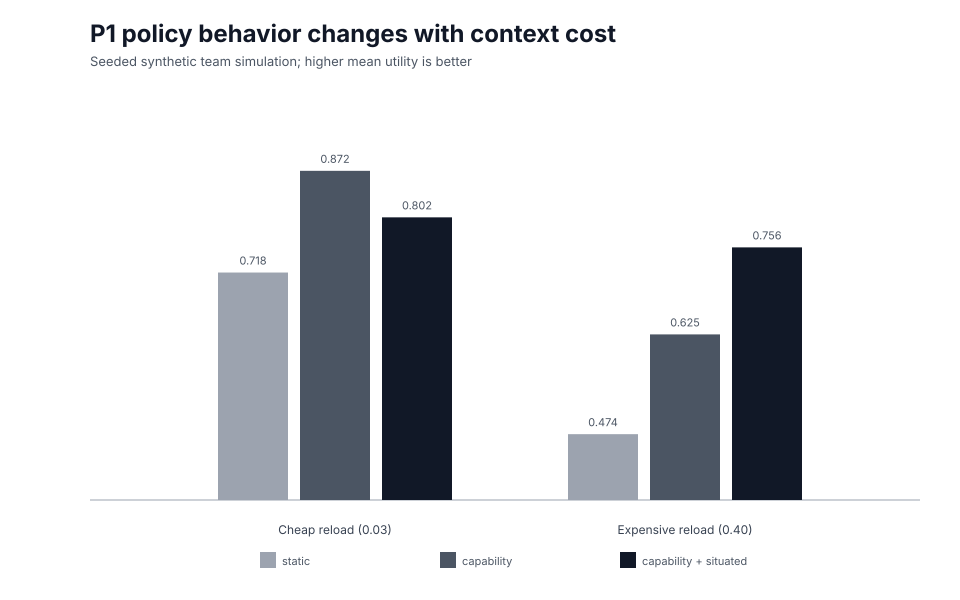

# Position Less Hoopers (PLH)

> **Organize around the state of the game, not the identities of the players.**

Position Less Hoopers (PLH) is an open research and engineering framework for **need-first, state-responsive coordination of multi-agent systems**.

Most agent teams begin with identities: planner, researcher, coder, reviewer. PLH begins with the **state of the work**. Agents keep capabilities and context; temporary responsibilities emerge from what the current situation needs.

<p align="center">
  
</p>

<p align="center">
  <strong>Same players. New state. New functions.</strong>
</p>

## Why PLH?

The core idea comes from position-less basketball:

- players have capabilities, not permanent positions;
- the court changes continuously;
- useful responsibility depends on where everyone is now;
- spacing matters at the team level;
- help, switches, and rotations emerge from the state of play;
- freedom to move does not imply freedom to change the score.

Translated to agent systems:

```text
agent capabilities + current situatedness
                 ×
       current unmet Need
                 ↓
       temporary Responsibility
                 ↓
     bounded execution authority
                 ↓
 deterministic evidence-gated commit
```

The persistent object is not a job title. The persistent objects are capabilities, authoritative state, evidence, and policy.

### Hoopers Arena: a controlled 5v5 mechanism study

In **Last Possession**, the same five offensive players face two authoritative states: man coverage, then a hard trap with weak-side rotation. The state change replaces the active functions themselves:

```text
man coverage
→ primary creation / ball screen / two-side spacing / rim pressure

hard trap
→ ball security / release outlet / short-roll connector / weak-side lift / rim window
```

Because five agents cover five Needs, Hoopers Arena can enumerate all **5! = 120** feasible assignments and compute an exact CoordinationTarget oracle under the declared utility. The strengthened v2 single-trap scenario does **not** separate PLH from a globally optimized dynamic-predefined-function baseline: both reach regret **0**, while fixed-position and fixed-archetype baselines each incur regret **0.667**.

To avoid tuning one favorable possession, the repository now freezes a three-state-shift suite before evaluation: hard trap, switch mismatch, and paint collapse. Across that suite, the dynamic-predefined-function baseline matches the oracle in **1/3** shifts and has mean oracle regret **0.392**; fixed-position and fixed-archetype baselines each average **0.373** regret. PLH is the exhaustive assignment oracle under the declared state-derived utility, so these are controlled mechanism results rather than claims about real-world basketball optimality.

<p align="center">
  
</p>

The important failure path is explicit: a Responsibility can end while its Need remains unresolved. Missing evidence reopens the Need instead of silently erasing the work.

## Current implementation status

PLH is being built in phases so that each coordination mechanism can be measured independently.

| Phase | Status | What it establishes |
|---|---|---|
| P0 — CoordinationField | ✅ implemented | deterministic coverage, overlap, contention, evidence-gap observability |
| P1 — Candidate matching | 🧪 experimental | static vs capability vs capability + situatedness |
| P1 — Context calibration | 🧪 synthetic | when locality is worth capability sacrifice |
| P1 — Warm/cold context | 🚧 harness ready | empirical cost of losing situated context |
| P2 — Need + Responsibility | ✅ implemented | deterministic Need admission + temporary leased Responsibility |
| P2.5 — Coordination cycle | ✅ implemented | Need → match → Responsibility → evidence → satisfied/reopened |
| P3a — Semantic spacing measurement | ✅ implemented | semantic Need overlap, intentional verification, marginal coverage |
| P3b — Team-aware allocation | ✅ implemented | deterministic marginal team utility selects which Need to cover next |
| P3c — Help | ✅ implemented | blocked/uncertain situations derive governed child Needs instead of helper roles |
| P4 — Switching + rotations | ✅ implemented | hysteretic reassignment with forced recovery and Need preservation |
| P5a — Read-and-react adaptive region | ✅ implemented | bounded Need/help/switch/evidence loop with typed exit conditions |
| P5b — Pressure triggers | 🧪 experimental | sandpile-inspired threshold, cascade, and group triggers for reevaluation |
| P6a — RunnerPort | ✅ implemented | provider-neutral ExecutionRequest/Result contract |
| P6b — Local runner | ✅ implemented | deterministic subprocess adapter + telemetry |
| P6c — TaskPack portability | ✅ implemented | generic seed/contract/grader/scenario interface across multiple task domains |
| P6d — Command-agent adapter | ✅ implemented | file-based provider-neutral agent protocol + external grading |
| P6e — Clean experiment matrix | ✅ implemented | TaskPack × policy orchestration with machine-readable cell results |
| P6f — Perturbed experiment matrix | ✅ implemented | two-phase contract reveal/mutation recovery with recovery latency and exclusions |
| P6g — Event-driven policy matrix | ✅ implemented | policy-specific real-agent recomputation/trigger behavior across an event stream |
| ORCA AX vertical slice | 🧪 experimental | guarded wake-up → Need → situated assignment → Responsibility → real execution → authoritative evidence |
| P6h — Live worker interruption | next | session interruption + reassignment for real worker-loss recovery |

Current local suite: **212 deterministic tests**.

## A result we already care about

The current synthetic experiments are deliberately not presented as real-agent evidence. They do reveal the mechanism we need to measure empirically.

In the seeded simulator:

- capability-only is better when reconstructing context is cheap;
- capability + situatedness becomes better when context loss is sufficiently expensive;
- situated assignment reduces context reload frequency dramatically;
- the synthetic crossover occurs near a context-loss penalty of **0.159** in the simulator's arbitrary utility scale.

That motivates the next real experiment: measure the actual operational cost of giving the same model a warm versus cold task context.

The current P4 switching pilot also compares three policies on the same state-change trace. In the synthetic mechanism test, no-switch fails to recover after worker loss, greedy switching recovers with extra churn, and PLH hysteresis recovers with one forced switch and no unnecessary switches.

<p align="center">
  
</p>

<p align="center">
  
</p>

## Quick start

Requires Node.js 20+.

```bash
npm test
npm run build:figures
```

PLH currently has **no runtime dependencies**.

Project a JSON snapshot into a deterministic CoordinationField:

```bash
npm run field -- fixtures/p0/clean.json --metrics
```

The output includes coverage, structural overlap, contention, evidence gaps, resource facts, and provenance references.

## Local visualizers

Two dependency-free browser views are included:

```text
visualizer/index.html        # CoordinationField / "court" viewer
visualizer/experiments.html  # experiment dashboard
```

The experiment dashboard is generated from the same functions used by the test suite.

## Repository map

```text
src/                     core PLH reference algorithms
test/                    deterministic invariant/mechanism tests
schemas/                 machine-readable experiment contracts
fixtures/                reproducible test/experiment inputs
benchmarks/courtshift/    perturbation protocol
artifacts/data/           generated experiment data
artifacts/figures/        generated paper/development figures
visualizer/               local interactive views
docs/                     protocol, metrics, calibration, roadmap
paper/                    paper claims, outline, figure/table plan
```

## CourtShift

CourtShift is PLH's perturbation layer for studying adaptation under changing state.

Initial perturbations include:

- worker loss,
- external workspace mutation,
- hidden integration failure,
- requirement shift,
- candidate/provider unavailability,
- conflicting concurrent mutation,
- assumption invalidation,
- late independent refute,
- stale context.

Every perturbation should have a clean twin, deterministic injection semantics, an external correctness grader, and machine-readable recovery criteria.

CourtShift is not yet claimed as a standalone benchmark. It earns that label only once its format is documented independently of PLH/ORCA and can be consumed by non-PLH runners.

## Relationship to ORCA

PLH is the coordination framework.

[ORCA](https://github.com/ShawnCholeva/orca) is the intended first full reference integration: its deterministic state, authority, evidence, and execution harness are a natural substrate for PLH.

```text
PLH
  coordination semantics
        |
        v
ORCA
  deterministic harness / reference implementation
        |
        +-- local runners
        +-- Google AX / other execution substrates
```

PLH must remain semantically separable from ORCA so that the research contribution can be tested across runtimes.

## Research questions

The paper is designed around falsifiable comparisons:

1. Does need-first coordination degrade less under mid-run perturbations than role-first coordination?
2. Does situatedness improve assignment over capability-only selection?
3. Does position-less coordination recover faster after worker/environment/assumption changes?
4. Can team-level spacing reduce accidental duplicate effort without suppressing deliberate independent verification?
5. Can fluid responsibility preserve deterministic authority, evidence, and state-consistency invariants?

## Baselines

The planned evaluation ladder is:

- **B0** — strong single agent
- **B1** — static workflow routing
- **B2** — fixed specialist team
- **B3** — dynamic assignment into predefined roles
- **P** — PLH: state → Need → temporary Responsibility

The B3 comparison is important: PLH does **not** claim that dynamic role assignment itself is novel.

## Paper

Working title:

**Position Less Hoopers: Need-First Coordination for State-Responsive Multi-Agent Systems**

Conceptual line:

**Roles Are Events, Not Identities**

The code and paper share one implementation. Paper-only mechanisms must be labeled as simulations and may not be described as released PLH behavior.

See:

- [Research protocol](docs/RESEARCH_PROTOCOL.md)
- [Publication roadmap](docs/PUBLICATION_ROADMAP.md)
- [Paper claims](paper/CLAIMS.md)
- [Paper outline](paper/OUTLINE.md)
- [Figure and table plan](paper/FIGURE_PLAN.md)

## Reproducibility discipline

Before held-out comparative evaluation we will freeze:

- primary endpoints,
- baseline definitions,
- perturbation semantics,
- matcher coefficient/range,
- exclusion rules,
- grader versions.

Each experimental run should carry a machine-readable manifest containing code/config versions, model pool, timing, outcome, grader, cost, trace, and artifacts.

## License

Apache-2.0.
